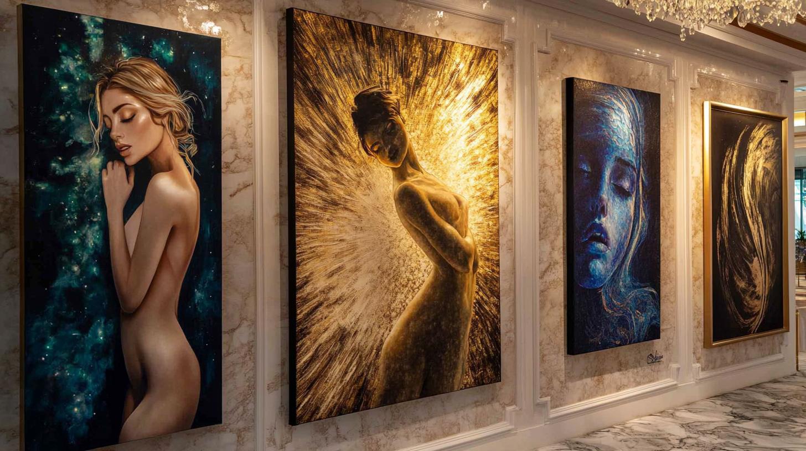

# Welcome to Ephraim Designs

At **Ephraim Designs**, we specialize in creating transformative, faith-centered art that inspires and elevates the spaces around you. Led by **Jason E. Rakich**, our work blends artistry with a deep sense of community and spirituality. Explore our murals, canvas paintings, live events, and more as we bring your vision to life.

---

## About Us

We are passionate about connecting with people through art. Every brushstroke tells a story, and every project embarks on a journey toward meaningful expression. From custom murals to engaging live art events, **Ephraim Designs** delivers creative experiences that celebrate faith, creativity, and community.

---

## Portfolio Highlights

Discover the diversity and depth of our creations:

- 🎨 **Murals**: Transforming walls into living stories for homes, businesses, and public spaces.
- 🖼️ **Canvas Paintings**: Tailored artwork that reflects your style and values.
- 🎭 **Live Art Events**: Witness creativity unfold in real time at public and private gatherings.
- 🤝 **Community Projects**: Strengthening bonds through collaborative and inspiring art.

Visit our [Portfolio](portfolio/murals.md) to explore more of our work.

---

## Services We Offer

Our range of services is designed to bring your artistic vision to life:

- **Custom Murals**: Unique designs tailored to homes, businesses, and places of worship.
- **Canvas Paintings**: From abstract explorations to narrative masterpieces, crafted just for you.
- **Live Painting Events**: Interactive and immersive art experiences that captivate audiences.
- **Workshops & Classes**: Unlock your creativity with hands-on artistic guidance.

Learn more on our [Services](services.md) page.

---

## Community Engagement

Art has the power to connect and inspire. At **Ephraim Designs**, we actively participate in our local community through:

- **Collaborative Projects**: Creating meaningful art alongside neighbors and friends.
- **Festivals & Events**: Bringing vibrant live art to life at public gatherings.
- **Mentorship**: Nurturing the next generation of artists through teaching and encouragement.

Read about our efforts in [Community Engagement](community-engagement.md).

---

## Get In Touch

We’d love to hear from you! Reach out to discuss your next project, commission a piece, or simply connect with us:

- **Email:** [JasonRakich@outlook.com](mailto:JasonRakich@outlook.com)
- **Phone:** 330-347-8698 | 330-465-2417
