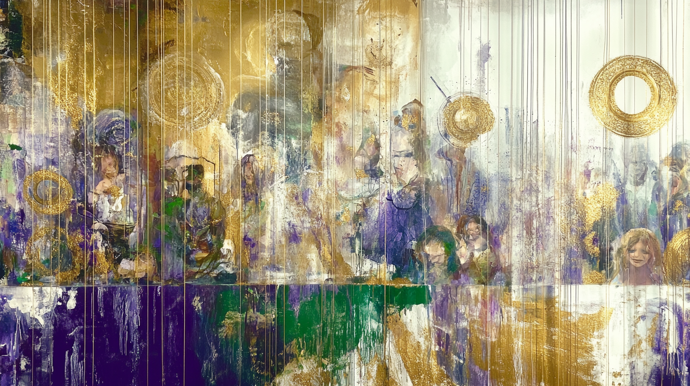
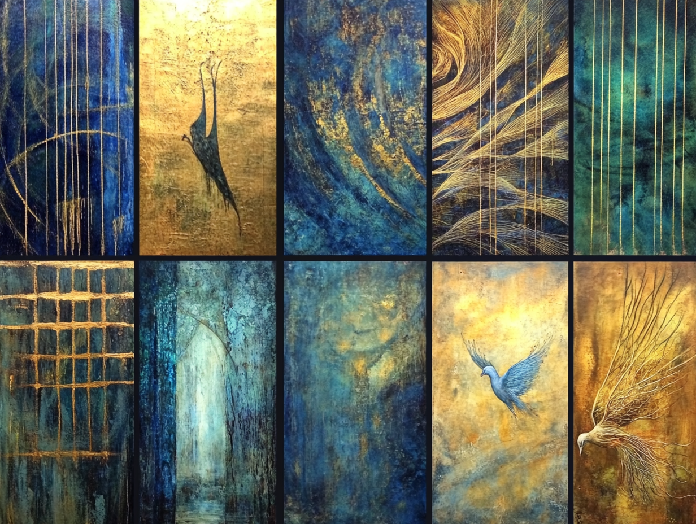

# Ephraim Designs Portfolio

Welcome to the **Ephraim Designs Portfolio**—where divine inspiration meets a shot of creative adrenaline. These aren’t just projects; they’re stories that leap off the wall, hum through guitar strings, and even make your taste buds do a double take. Let’s dive into the sauce, shall we?

---

## **What’s Cooking in the Portfolio**

### **[Murals](murals.md)**

Walls that speak louder than words. Explore Jason’s large-scale works blending faith, community, and an unapologetic dash of rebellion.

---

### **[Paintings](paintings.md)**

Abstracts and narratives that demand a second look. Think layered textures, radiant colors, and just enough edge to keep things interesting.

---

### **[Live Art & Music](live-art.md)**

Creativity in motion. From live painting to musical performances, Jason’s art doesn’t just sit there—it moves you.

---

### **[Other Projects](other.md)**

Hot sauce labels, quirky commissions, and the experimental edge that keeps Jason’s work fresh. This is where creativity runs wild.

---

## **Highlights to Turn Up the Heat**

**Flamingo Jack’s Food Truck Mural**

A tropical explosion of humor and color that turns heads (and maybe earns extra tips).

**Obie One Kanibbie Mural**

A Jedi cat with enough swagger to take on the Empire—and make you smile while doing it.

**Solar Skyline Painting**

Abstract art that channels renewal and spirituality, glowing like a sunrise after a storm.

**Jdizzle Drizzle Sauce Line**

Hot sauce with bold flavors and even bolder labels—because art isn’t just for walls.

---

## **Explore. Admire. Commission.**

Every piece in this portfolio is a little rebellious, a little spiritual, and a lot unforgettable. Whether it’s a mural, a painting, or something in between, Jason’s work isn’t here to blend in—it’s here to make a statement.

---

## **Bring Your Vision to Life with Ephraim Designs**

Whether it’s a mural for your space, a canvas for your story, or an idea waiting to be painted, **Ephraim Designs** is here to make it happen. Let’s collaborate and create something extraordinary.

[Visit Our Contact Page](contact.md) to start your next masterpiece.

> _Ephraim Designs: Creativity. Spirituality. Passion._
